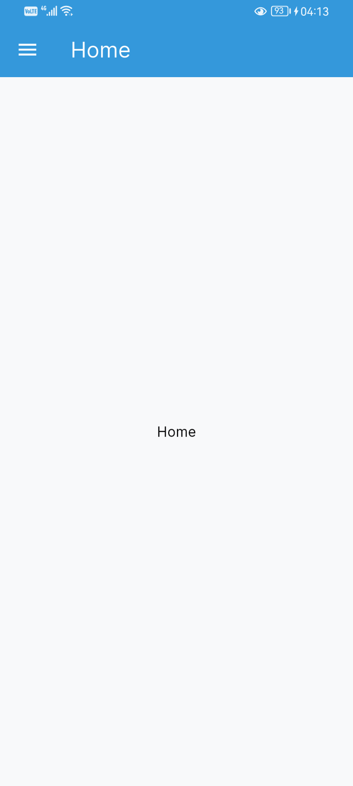

# Invoice Application

This is a simple invoice application to manage inventory and generate invoices.

# Demo

Demo This application is available for demo at [https://invoice-app-p484.apps.alashoor.dev](https://invoice-app-p484.apps.alashoor.dev).

# Roadmap

- [x] User authentication UI
- [x] Settings UI
- [ ] Manage Users UI
- [ ] Inventory UI
- [ ] Invoices UI
- [ ] Invoice PDF generation
- More features will be added in the future. (Focus on the UI first)

# Screenshots

<table>
  <tr>
    
    
    
    
  </tr>
   
  <tr>
    
    
    
    
  </tr>
</table>

# License

This project is licensed under the MIT License. See the [LICENSE](LICENSE) file for details.